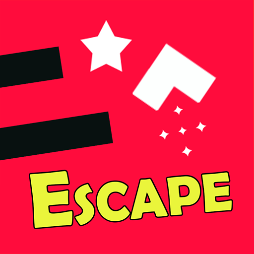
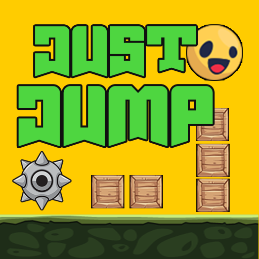
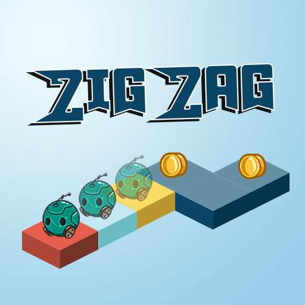
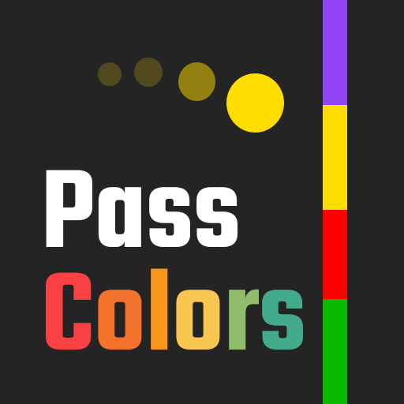

# Mahwous Games

Welcome to the official repository of **Mahwous Games**! This repository contains four exciting games developed and designed using the **Buildbox 2** game engine. Explore the details of each game below.

## Games

### 1. Arrow Escape

*Description*: Navigate your arrow through a series of obstacles in this fast-paced, challenging game. Test your reflexes and timing to escape the traps!

---

### 2. 002 Just Jump

*Description*: A simple yet addictive jumping game. Tap to make your character jump and avoid the obstacles. How far can you go?

---

### 3. 003 Zig Zag Balance

*Description*: Keep your balance as you zig-zag along a narrow path. This game tests your coordination and concentration.

---

### 4. 004 Pass Colors

*Description*: Match the colors to pass through barriers. Quick thinking and precision are key in this colorful challenge!

---

## Google Play Store

All of these games are available on the **Google Play Store** and come integrated with **Google Play Services**. Each game features a **scoreboard** to challenge your friends and compete for the highest scores!

---

## About Mahwous Games

**Mahwous Games** is dedicated to creating engaging and fun gaming experiences. Our games are designed to challenge, entertain, and provide a unique experience for players of all ages.

